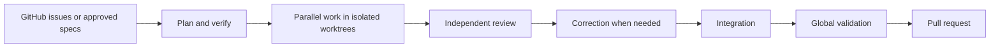

# Kiln

Kiln runs coding agents as a recoverable, verifiable workflow—from open GitHub issues or approved specs to validated pull requests.

Kiln owns the run. Agents handle individual jobs. Kiln keeps the plan, coordinates isolated work, records evidence, and decides what can proceed.

[](https://www.rust-lang.org/)

## Why Kiln

- Independent tickets can run in parallel in separate Git worktrees.
- A separate agent context reviews each implementation against the actual commit.
- Failed reviews can trigger bounded correction cycles.
- Integration and validation check the combined result before publication.
- Runs persist across interruption and reconcile recorded progress with Git state.
- Agents and project commands run under explicit isolation and allow-list policies.
- Missing evidence is not success; opening a pull request does not authorize merging or deployment.

## Install

You need Rust and Git. Linux workflow execution also requires `bubblewrap` (`bwrap`).

```sh
git clone https://github.com/VictorGTheCoder/Kiln.git
cd Kiln
cargo install --path .
```

Kiln installs from source. For development, use `cargo build` and `cargo test`.

## Run Kiln on a repository

Add a `kiln.json` to the target repository to define project checks and isolation:

```json
{
  "build": ["cargo", "build"],
  "test": ["cargo", "test"],
  "startup": ["cargo", "run"],
  "acceptance_criteria": ["The combined application fulfills the approved specs"],
  "isolation": {
    "network": "none",
    "runtime": "system",
    "commands": [["cargo", "build"], ["cargo", "test"], ["cargo", "run"]],
    "secrets": {}
  }
}
```

From that repository, plan its open GitHub issue graph, then start the run:

```sh
kiln plan
kiln start
```

Kiln infers the repository, `kiln.json`, GitHub repository from `origin`, and available coding agent. Use `--repo`, `--config`, `--github-repo`, `--codex`, or `--claude` to override inputs. `kiln plan --json` and `kiln start --json` print machine-readable run state; `kiln start --fresh` plans again instead of reusing an unchanged plan.

`kiln start` plans and verifies the issue graph, runs eligible tickets, delivers validated groups as pull requests, and waits for CI. You can also prepare a run from approved Markdown specs; see [configuration and CLI usage](docs/configuration.md).

## Monitor and control a run

`kiln start` serves a local dashboard while it runs. Use `kiln dashboard` to open the dashboard without starting a run. It shows runs, ticket stages, active work, pull requests, and CI status.

```sh
kiln status
kiln logs --follow
kiln pause
kiln resume
kiln cancel
```

`kiln status` summarizes the latest run. `kiln logs` reads its event journal. Pause lets active ticket work settle; resume reconciles state and continues. Cancel safely stops active work and is terminal.

## How it works



Planning freezes requirements and verifies ticket coverage and dependencies. Independent tickets run concurrently; blocked tickets wait for prerequisites. Review checks the implementation commit against project standards and requirements. Required findings can start a bounded correction cycle. Kiln validates the combined integration commit before publishing it. See [implementation tickets](docs/implementation-tickets.md), [integration](docs/integration.md), [validation](docs/validation.md), and [publication](docs/publication.md) for details.

## Safety and recovery

On Linux, `bubblewrap` isolates agent and project processes. `kiln.json` declares permitted commands, network policy, runtime mounts, and scoped secrets. Isolation failures do not silently fall back to unrestricted execution. The [configuration guide](docs/configuration.md) describes the security model and its limits.

Run state, reviews, corrections, and validation evidence are stored under `.kiln/` in the target repository. After interruption, Kiln reconciles that record with Git and process state before continuing. Deterministic fixtures support testing without a provider account; they do not measure model quality.

## Coding agents

Kiln supports Codex and Claude Code. Planning, implementation, and review use separate agent contexts. Kiln retains control of Git operations, run state, validation, and delivery.

## Documentation

- [Configuration and CLI usage](docs/configuration.md)
- [Product specification](docs/spec.md)
- [Backlog runs](docs/backlog.md)
- [Implementation tickets](docs/implementation-tickets.md)
- [Integration](docs/integration.md)
- [Validation](docs/validation.md)
- [Publication](docs/publication.md)
- [Pilot readiness](docs/pilot-readiness.md)
- [Pilot import](docs/pilot-import.md)
- [Codex smoke testing](docs/codex-smoke.md)
- [Claude Code smoke testing](docs/claude-smoke.md)
- [Demo fixtures](demo/README.md)

## Project status

Kiln is under active development. The project is evolving its CLI and dashboard while measuring the workflow in a competitive pilot: [CLI simplification](https://github.com/VictorGTheCoder/Kiln/issues/50), [CLI and web convergence](https://github.com/VictorGTheCoder/Kiln/issues/74), and [competitive pilot](https://github.com/VictorGTheCoder/Kiln/issues/35).
